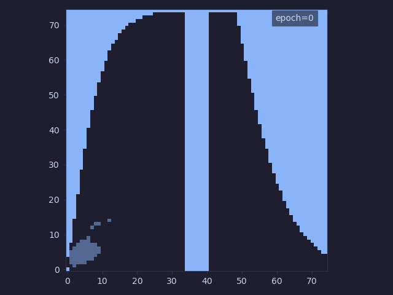
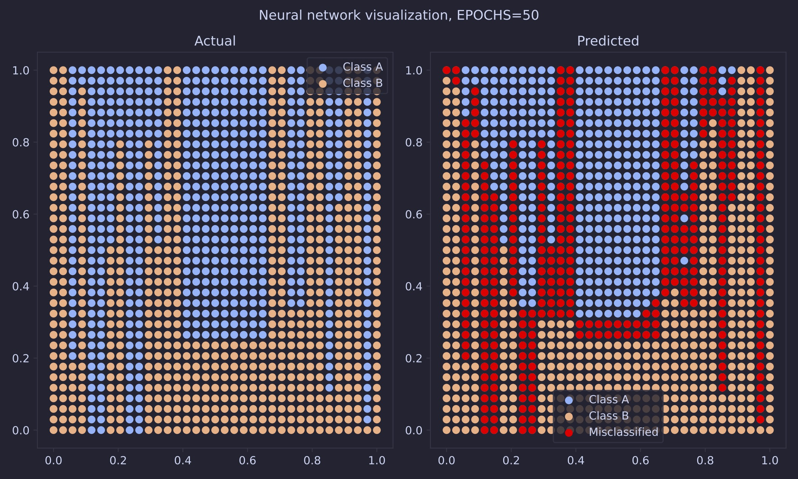
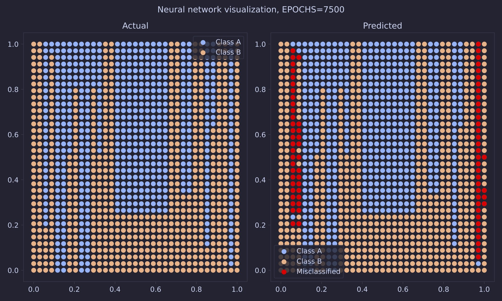

# Simple Neural Networks
A minimalist implementation of neural networks with an API similar to Keras.

## Features
- Batching.
- Vectorized implementation.
- Common layers, activation functions and optimizers.

## Results

